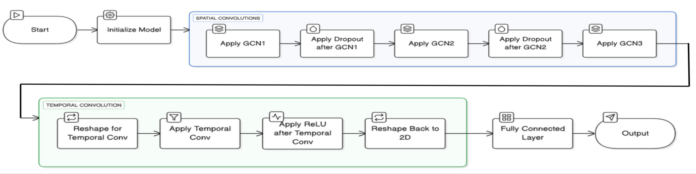
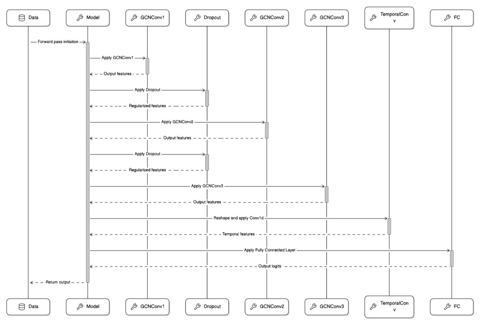
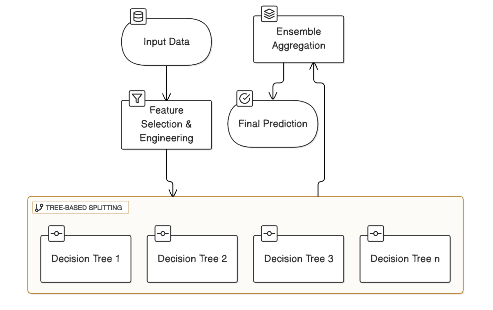
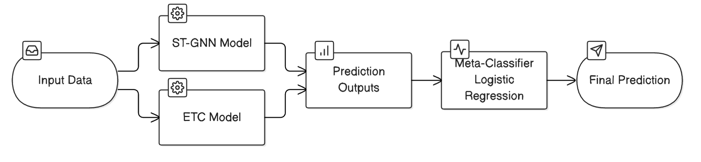

# 🚗 Road Crash Injury Severity Prediction

> **Project** · VIT-AP University · Apr 2024  
> **Team:** Sri Hari Priya Panchumarthi · **Samuel Mekala**  
> **Guide:** Dr. Deepthi Godavarthi · School of Computer Science and Engineering (SCOPE)

[](https://python.org)
[](https://pytorch.org)
[](/.github/workflows/ci.yml)

-----

## 📌 Overview

Road accidents claim millions of lives annually. Accurate prediction of injury severity immediately after a crash can significantly improve emergency response and resource allocation. This project develops a **hybrid machine learning model** that combines **Spatio-Temporal Graph Neural Networks (ST-GNN)** with an **ExtraTreesClassifier** to predict crash injury severity from real-world accident data.

**Achieved 96.46% accuracy** — one of the highest reported for this class of problem.

-----

## 🏗️ System Architecture
  
```
                        UK Road Accident Dataset (1.5M+ records)
                                      │
                                      ▼
                        ┌─────────────────────────────┐
                        │     Data Preprocessing      │
                        │  • Drop redundant features  │
                        │  • Impute missing values    │
                        │  • Label encode categoricals│
                        │  • StandardScaler normalize │
                        │  • SMOTE oversampling       │
                        └────────────┬────────────────┘
                                     │
                            ┌────────┴────────┐
                            ▼                 ▼
                        ┌──────────┐    ┌──────────────────┐
                        │   ETC    │    │    ST-GNN        │
                        │ Extra    │    │ kNN graph →      │
                        │ Trees    │    │ 3-layer GCN +    │
                        │Classifier│    │ Dropout(0.5)     │
                        └────┬─────┘    └──────┬───────────┘
                             └────────┬─────────┘
                                      ▼
                           Logistic Regression Meta-Classifier
                                      │
                                      ▼
                          Injury Severity Prediction: Slight / Serious / Fatal
```
 
---
 
## 📊 ST-GNN Architecture & Flow
 


 


---

## 📊 Model Training

## Extra Tree Classifier



## 📊 Hybrid Model Framework



## 📈 Results
 
| Model | Accuracy | Precision | Recall | F1 |
|---|---|---|---|---|
| ST-GNN (standalone) | 85.26% | 0.73 | 0.85 | 0.78 |
| ExtraTrees (standalone) | 92.31% | 0.88 | 0.85 | 0.90 |
| **Hybrid Ensemble** | **96.46%** | **0.97** | **0.96** | **0.96** |

-----

## 🔑 Key Engineering Decisions

**Why this hybrid?**

- **ST-GNN** captures *where* and *when* crashes cluster — spatial proximity (dangerous intersections) and temporal patterns (rush hour, weekends)
- **ExtraTrees** captures *feature-level* patterns — vehicle type, speed, road condition, weather
- Together, they cover both **context** and **attributes**
 
**Why ExtraTrees over Random Forest?**
Fully random split thresholds — faster and less prone to overfitting on high-dimensional accident data.
 
**Why kNN for graph edges?**
Accidents near each other geographically and temporally share severity patterns. kNN (k=5) captures this without needing explicit road network data.
 
**Why SMOTE?**
Fatal accidents (~5%) are severely underrepresented. SMOTE generates synthetic minority samples preserving feature distributions.
 
**Why Logistic Regression as meta-classifier?**
Interpretable, fast, and learns a linear boundary in the combined prediction space of both models.

---

## 📊 Dataset

**UK Road Accident Dataset** (Kaggle) — 1.5M+ real accident records with features including:

- Location (latitude/longitude), date/time, road conditions
- Vehicle type, speed limit, junction detail
- Weather conditions, light conditions
- **Target:** Accident Severity (1 = Slight, 2 = Serious, 3 = Fatal)

-----

## ⚙️ Preprocessing Pipeline

```
Raw Accident Dataset (1.5M+ records)
    → Drop redundant identifier columns
    → Drop columns with >40% missing values
    → Impute numeric with median
    → Label Encoding (categorical → numeric)
    → StandardScaler normalization
    → SMOTE oversampling (handle class imbalance)
    → Train/Test Split (80/20)
    → kNN Graph Construction (k=5, spatial proximity)
```

-----

## 🛠️ Tech Stack
 


-----

## 📁 Project Structure

```
road-crash-severity/
├── .github/
│   └── workflows/
│       └── ci.yml                      # GitHub Actions CI
├── images/
│   ├── hybrid_model.png                # Full hybrid architecture diagram
│   ├── stgnn_flow.png                  # ST-GNN flow diagram
│   ├── stgnn.png                       # ST-GNN Architecture
│   └── ETC.png                         # Ectra Tree Classifier Architecture
├── analysis.py                         # EDA — boxplots, correlation, count plots
├── train.py                            # Full pipeline — preprocessing → ST-GNN → ETC → ensemble
├── road_crash_severity.ipynb           # Full notebook with explanations
├── requirements.txt
└── README.md
```

-----

## 🚀 How to Run
 
```bash
# Clone the repo
git clone https://github.com/samuel-mekala/road-crash-severity.git
cd road-crash-severity
 
# Install dependencies
pip install -r requirements.txt
 
# Download UK Road Accident Dataset from Kaggle → place as data/UK_Accident.csv
# https://www.kaggle.com/datasets/silicon99/dft-accident-data
 
# Run EDA first
python analysis.py
 
# Train the hybrid model
python train.py
 
# Or explore full notebook
jupyter notebook road_crash_severity.ipynb
```

-----

## 🔮 Future Work

- [ ] Real-time prediction API for emergency services
- [ ] Replace kNN edges with actual road network graph (OSMnx)
- [ ] Integration with live traffic data streams
- [ ] Expand to national highway networks
- [ ] Explainability with SHAP for black-box transparency

-----

*VIT-AP University · SCOPE · Project · Apr 2024*
